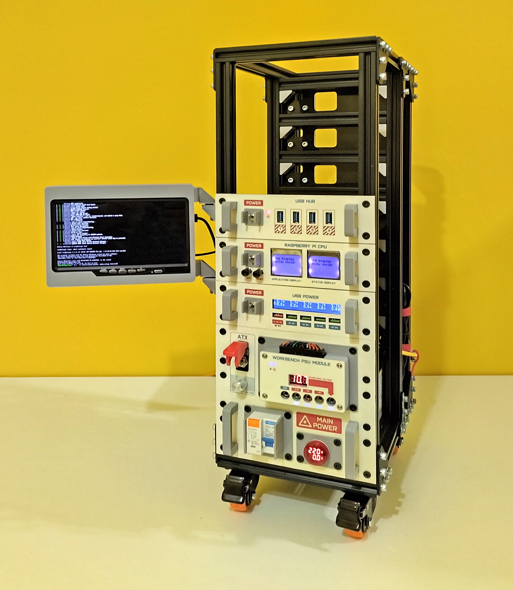
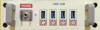
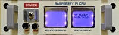
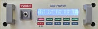
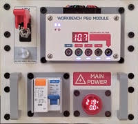
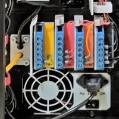
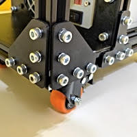
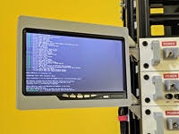
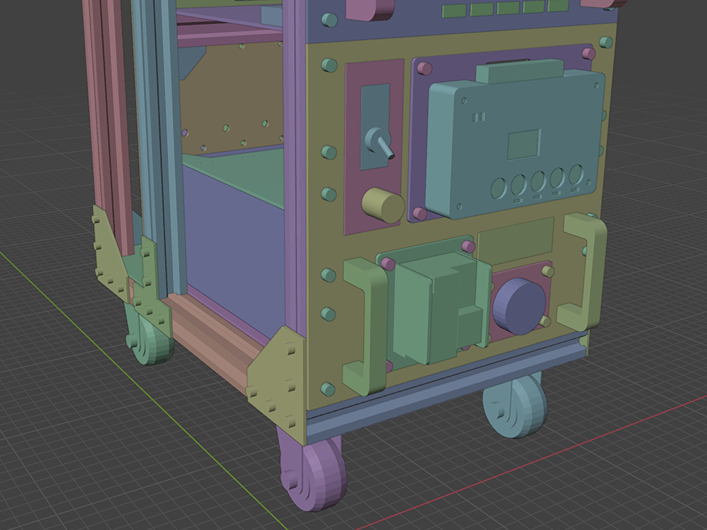

# My IOT Minilab

## Description

This is my IoT minilab. A platform to make projects and experiments involving the internet of things and electronics.
This is an open source project and you will find all necessary information to reproduce this project, modify it, contribute with it, etc.

I hope you enjoy it :)

## Features

- Rack mounted in a "maker style", so you can easily modify it, extend it, create new modules, etc.
- You can also use it as a workbench tool.
- ATX PSU (3.3V, 5V, 12V and adjustable voltage) for the built-in modules and for the workbench experiments and tests.
- USB PSU/charger, for those devices that uses USB power cord, inside the rack or on the workbench.
- Small CPU module with USB hub for conecting to your IOT devices (yes yes, inside the rack or on the workbench).
- It uses ready-made parts, so you don´t have to make printed circuit boards!

## Structure and Modules

|Picture|Documentation|
|---|---|
||[USB Hub Module](readme-module-usbhub.md)|
||[Raspberry Pi CPU Module](readme-module-rpicpu.md)|
||[USB Power Module](readme-module-usbpower.md)|
||[PSU Module](readme-module-psu.md)|
||[Rear](readme-rear.md)|
||[Structure](readme-structure.md)|

## Extras

Some optional stuffs that may be usefull:

|Picture|Documentation|
|---|---|
||[Support for velcro strap](readme-extra-velcrostrap.md)|
||[Mini LCD monitor](readme-extra-minilcdmonitor.md)|

## Blender Project

This minilab was designed on Blender 3D software. You can download the Blender project file [here](project/minilab.blend).

