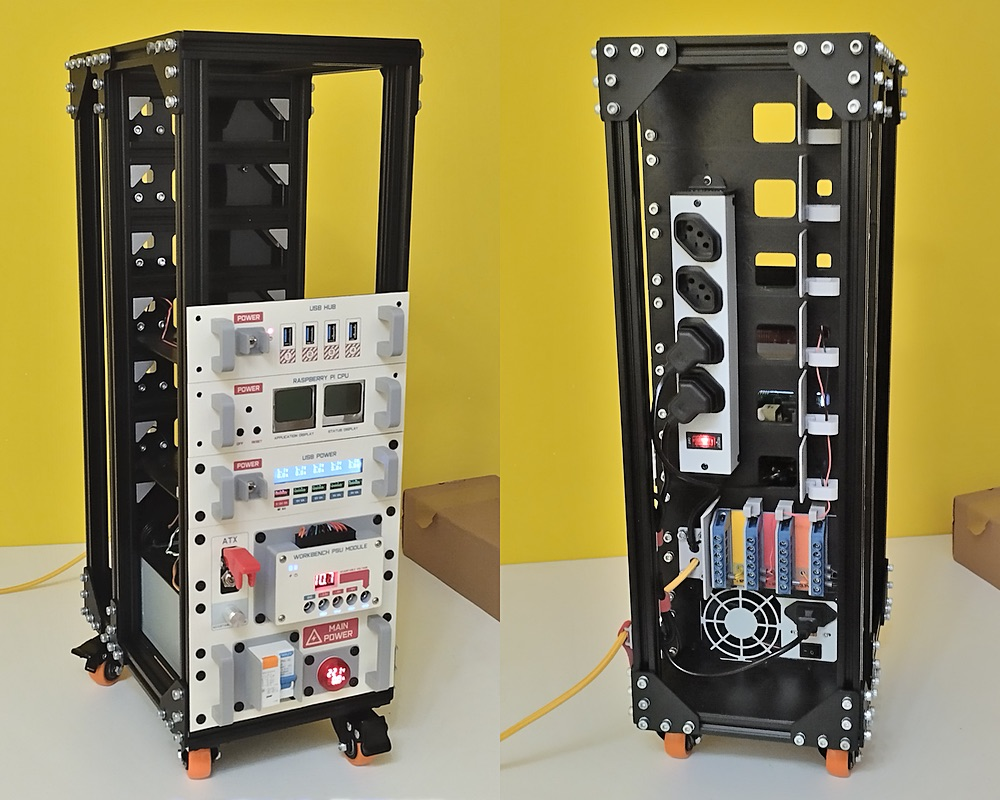
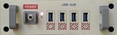
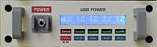
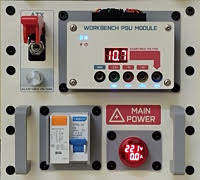

# Tio Luigi´s IOT Minilab

(work in progress)

## Description

This is the open project of my IOT minilab. The process of documenting it is a work in progress and I expect to finish it by the end of the year.

## Features

- Rack mounted in a "maker style" so you can easily modify, extend, create new modules, etc
- You can use it as a workbench tool too, providing an ATX PSU (3.3V, 5V, 12V and adjustable voltage), an USB PSU/charger, for those devices that use USB power cord and a small CPU module with USB hub for conecting to your IOT device on the workbench
- Use ready-made parts, so you don´t have to make printed circuit boards

## Structure and Modules

|Picture|Documentation|
|---|---|
||.|
||[USB Power Module](readme-module-usbpower.md)|
||[PSU Module](readme-module-psu.md)|
