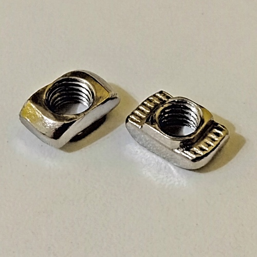

# Mini LCD Monitor Support

## Description

Support for this model of mini LCD monitor. It can be useful for maintenance activities on the Raspberry Pi, for example.

## 3D Printed Parts

To make the 3d printed parts, I used an Creality Ender 3 similar 3d printer. Some parts I printed with 0.8mm nozzle, just for speed gain (where aesthetics were not so important). For all the other parts, I used 0.4mm nozzle. The original editable Blender files are also included in the "3dprint" directory.

File|Prints|Nozzle|Supports|Description|
|---|---|---|---|---|
|[extra-minilcdmonitor-front.stl](./3dprint/extra-minilcdmonitor/extra-minilcdmonitor-front.stl)|1|0.4|No|Front cover.|
|[extra-minilcdmonitor-back.stl](./3dprint/extra-minilcdmonitor/extra-minilcdmonitor-back.stl)|1|0.4|No|Back cover.|
|[extra-minilcdmonitor-spacer.stl](./3dprint/extra-minilcdmonitor/extra-minilcdmonitor-spacer.stl)|4|0.4|No|Spacer.|

## Shopping List

Qty|Description|
|---|---|
| 1|Mini LCD Monitor (see pictures).|
| 4|20x20x17mm corner for V-slot or T-slot.|
| 1 ~ 3|Nylon cable ties.|
| 4|Allen Bolt M5x6 Flat Head.|
| 6|Spring Washer 5mm.|
| 2 ~ 4|Washer 5mm.|
| 2|Hammer Nut M5.|
| 2|Allen Bolt M5x40 (5mm on diameter, 40mm on length).|
| ~ 130g | PLA 3D print filament. |

## Nuts and Bolts

Picture|Description|
|---|---|
||Allen Bolt M5x6 Cylindrical Head (5mm on diameter, 6mm on length)|
||Allen Bolt M5x6 Flat Head (5mm on diameter, 6mm on length)|
||Hammer Nut M5 (for 5mm diameter bolts)|
||Spring Washer 5mm|

## Pictures

