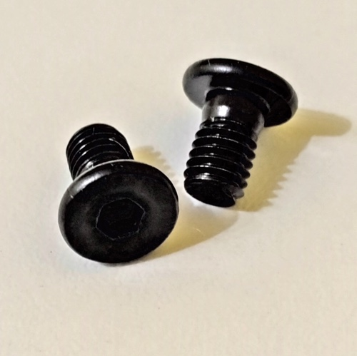

# Extra - Velcro Strap Support

## Description

Support for velcro strap, for a better cable organizing.

## 3D Printed Parts

To make the 3d printed parts, I used an Creality Ender 3 similar 3d printer. Some parts I printed with 0.8mm nozzle, just for speed gain (where aesthetics were not so important). For all the other parts, I used 0.4mm nozzle. The original editable Blender files are also included in the "3dprint" directory.

File|Prints|Nozzle|Supports|Description|
|---|---|---|---|---|
|[extra-velcrostrap.stl](./3dprint/extra-velcrostrap/extra-velcrostrap.stl)|1|0.4|Yes|Velcro Strap Support.|

## Shopping List

For each velcro strap support, you will need:

Qty|Description|
|---|---|
| 1|Velcro strap 12mm wide.|
| 1|Allen Bolt M5x6 Flat Head.|
| 1|Spring Washer 5mm.|
| 1|Hammer Nut M5.|
| ~ 2g | PLA 3D print filament. |

## Nuts and Bolts

Picture|Description|
|---|---|
||Allen Bolt M5x6 Flat Head (5mm on diameter, 6mm on length)|
||Hammer Nut M5 (for 5mm diameter bolts)|
||Spring Washer 5mm|
