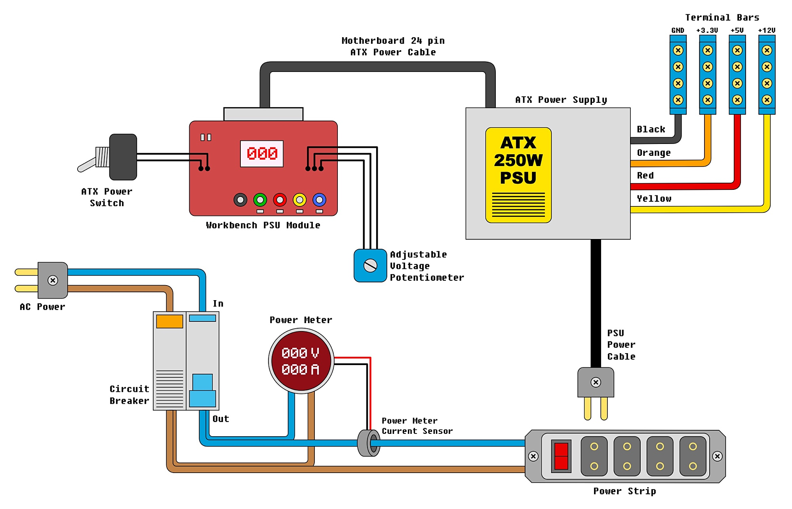
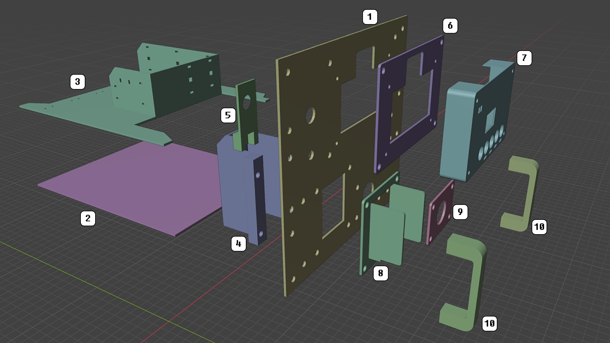

# PSU Module

## Description

The PSU (Power Supply Unity) Module is responsible to power up all the system. The main power switch is a 6A circuit breaker. In my project, I used a circuit breaker with residual current protection, to prevent electrical shock. There is also a power meter with a double display, for voltage and current measuring. The main power line ends in a power strip, in my case with 4 electrical outlets.

Connected to this power strip, there is an ATX Power Supply. For this project I used a 250W retail model. This ATX PSU powers the 4 terminal bars at the rear part of the rack. These terminal bars are used to power all the small circuits and IOT devices that uses 3.3V, 5V and/or 12V power.

The ATX PSU also powers a Workbench Module, used to provide voltage to workbench projects and experiments. Connected to this module, there is the ATX Power Switch, that starts up the ATX PSU and a potentiometer for adustable voltage output, provided by the workbench module too. 

## Schematics

## 3D Printed Parts

Caption|File|Prints|Description|
|---|---|---|---|
| 1|[psu.panel.front.stl](./3dprint/psu/psu.panel.front.stl) |1|ccc|
| 2|[psu.base.stl](./3dprint/psu/psu.base.stl)               |1|ccc|
| 3|[psu.cableguide.stl](./3dprint/psu/psu.cableguide.stl)   |1|ccc|
| 4|[psu.circuitbreakersupport.stl](./3dprint/psu/psu.circuitbreakersupport.stl) |1|ccc|
| 5|[potentiometersupport.stl](./3dprint/psu/psu.panel.potentiometersupport.stl) |1|ccc|
| 6|[psu.panel.modulecover1.stl](./3dprint/psu/psu.panel.modulecover1.stl)       |1|ccc|
| 7|[psu.panel.modulecover2.stl](./3dprint/psu/psu.panel.modulecover2.stl)       |1|ccc|
| 8|[psu.panel.circuitbreakerpanel.stl](./3dprint/psu/psu.panel.circuitbreakerpanel.stl)|1|ccc|
| 9|[psu.panel.meterpanel.stl](./3dprint/psu/psu.panel.meterpanel.stl) |1|ccc|
|10|[psu.panel.handler.stl](./3dprint/psu/psu.panel.handler.stl)       |2|ccc|

## Shopping List

aaa

## Pictures

