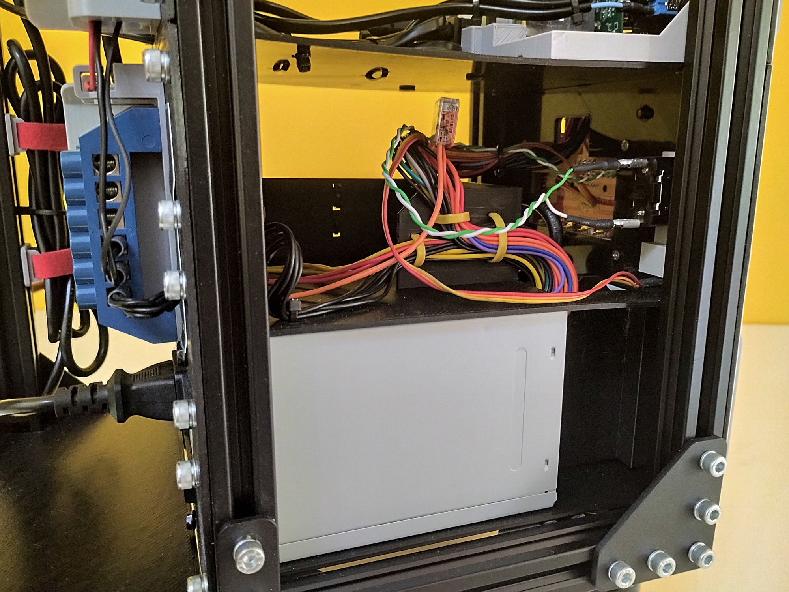

# PSU Module

## Description

The PSU (Power Supply Unity) Module is responsible to power up all the system. It´s the only module designed to be fixed (not so easily removable). The main power switch is a 6A circuit breaker. In my project, I used a circuit breaker with residual current protection, to prevent electrical shock. There is also a power meter with a double display, for voltage and current measuring. The main power line ends in a power strip, with 4 electrical outlets.

Connected to this power strip, there is an ATX Power Supply. I used a 250W retail model. This ATX PSU powers the 4 terminal bars at the rear part of the rack. These terminal bars are used to power all the small circuits and IOT devices that uses 3.3V, 5V and/or 12V power.

The ATX PSU also powers a Workbench Module, used to provide voltage to workbench projects and experiments. Connected to this module, there is a Power Switch, that starts up the ATX PSU and a potentiometer for adustable voltage output, provided by the workbench module too. 

## Schematics

## 3D Printed Parts

To make the 3d printed parts, I used an Creality Ender 3 similar 3d printer. Some parts I printed with 0.8mm nozzle, just for speed gain (where aesthetics were not so important). For all the other parts, I used 0.4mm nozzle. The original editable Blender files are also included in the "3dprint" directory.

Caption|File|Prints|Nozzle|Supports|Description|
|---|---|---|---|---|---|
| 1|[psu.base.stl](./3dprint/module-psu/psu.base.stl)|1|0.8|No|Module base, wich supports the ATX PSU.|
| 2|[psu.cableguide.stl](./3dprint/module-psu/psu.cableguide.stl)|1|0.8|Maybe|Inner cable guide. I didn't use supports.|
| 3|[psu.circuitbreakersupport.stl](./3dprint/module-psu/psu.circuitbreakersupport.stl)|1|0.8|No|Circuit breaker support. Necessary to keep the circuit breaker in the correct position and tight attached to the front panel.|
| 4|[psu.potentiometersupport.stl](./3dprint/module-psu/psu.panel.potentiometersupport.stl) |1|0.4|Yes|Adjustable voltage potentiometer support. Necessary to keep the potentiometer in the correct position and tight attached to the front panel.|
| 5|[psu.panel.front.stl](./3dprint/module-psu/psu.panel.front.stl)                 |1|0.8|No|Front panel, where all other panel components are attached to.|
| 6|[psu.panel.modulecover1.stl](./3dprint/module-psu/psu.panel.modulecover1.stl)   |1|0.4|No|Workbench module base.|
| 7|[psu.panel.modulecover2.stl](./3dprint/module-psu/psu.panel.modulecover2.stl)   |1|0.4|No|Workbench module cover.|
| 8|[psu.panel.circuitbreakerpanel.stl](./3dprint/module-psu/psu.panel.circuitbreakerpanel.stl)|1|0.4|No|Circuit breaker front protector.|
| 9|[psu.panel.meterpanel.stl](./3dprint/module-psu/psu.panel.meterpanel.stl) |1|0.4|No|Power meter front base.|
|10|[psu.panel.handler.stl](./3dprint/module-psu/psu.panel.handler.stl)       |2|0.4|Maybe|Left and right module handler. I used supports.|

## Paper Printed Parts

I used inkjet printer and an off-white 180g/m2 paper to make the front panel of the modules. In Brazil, this paper is known as "Color Plus 180g Marfim". To create these files, I used a software called "Graphics", that works on Mac. The original editable Graphics file for each print is in the "print" directory.

|File|Description|
|---|---|
|[print.psu.panel.pdf](./print/print.psu.panel.pdf)|PSU Module front panel.|
|[print.psu.panel.module.pdf](./print/print.psu.panel.module.pdf)|Workbench PSU Module panel.|
|[print.rear.labels.pdf](./print/print.rear.labels.pdf)|Rear Terminal Bars labels.|

## Shopping List

Qty|Description|
|---|---|
| 1|ATX power supply. 250W is far enough.|
| 1|ATX PSU breakout module (see pictures).|
| 1|Power strip with 4 outlets.|
| 1|6A circuit breaker. I uded a Tomzn C6 model.|
| 1|Voltage and current meter (see pictures).|
| 4|Terminal bars with 6 terminals each. I found mine in [this link](https://pt.aliexpress.com/item/1005004186912405.html).
| 1|Power plug.|
| 1|Power Switch. I used a margirius switch with protection cover.|
| 1|100K linear potentiometer (only if your breakout module came with a logarithmic one).|
| 1 meter|2.5mm blue wire, for internal wiring. Maybe you don´t need this, if you use the power strip cord.|
| 1 meter|2.5mm brown wire, for internal wiring. Maybe you don´t need this, if you use the power strip cord.|
| 1 ~ 2 meters|0.30mm wire, for connect the ATX Power Switch and the Potentiometer to the ATX breakout module.|
| 1 ~ 2 meters|Main power cord with plug.|
| 20 ~ 30|Nylon cable ties.|
|  8|Allen Bolt M5x6 Cylindrical Head.|
| 24|Allen Bolt M5x6 Flat Head.|
|  4|Spring Washer 5mm.|
| 12|Hammer Nut M5.|
|  8|Allen Bolt M3x20 with washer and pressure bolt.|
| ~ 320g | PLA 3D print filament. |

## Nuts and Bolts

Picture|Description|
|---|---|
||Allen Bolt M5x6 Cylindrical Head (5mm on diameter, 6mm on length)|
||Allen Bolt M5x6 Flat Head (5mm on diameter, 6mm on length)|
||Hammer Nut M5 (for 5mm diameter bolts)|
||Spring Washer 5mm|
||Allen Bolt M3x20 (3mm on diameter, 20mm on lenght) with washer and pressure bolt.|

## Pictures

