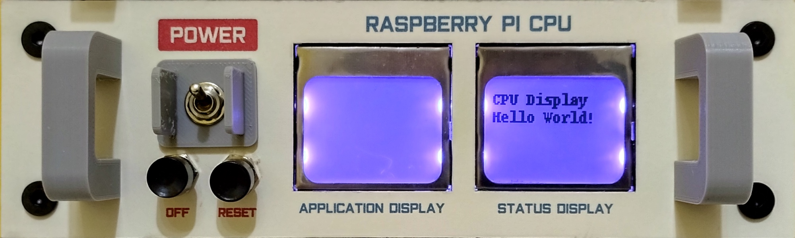
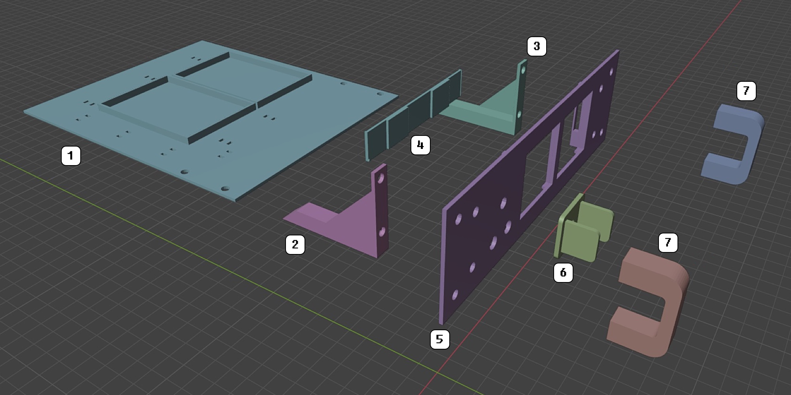
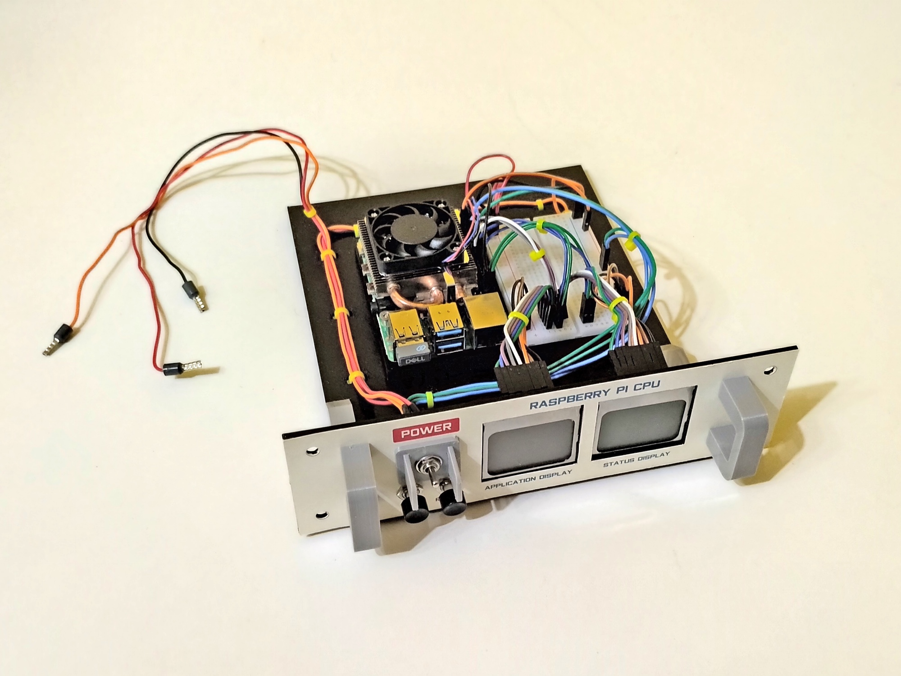
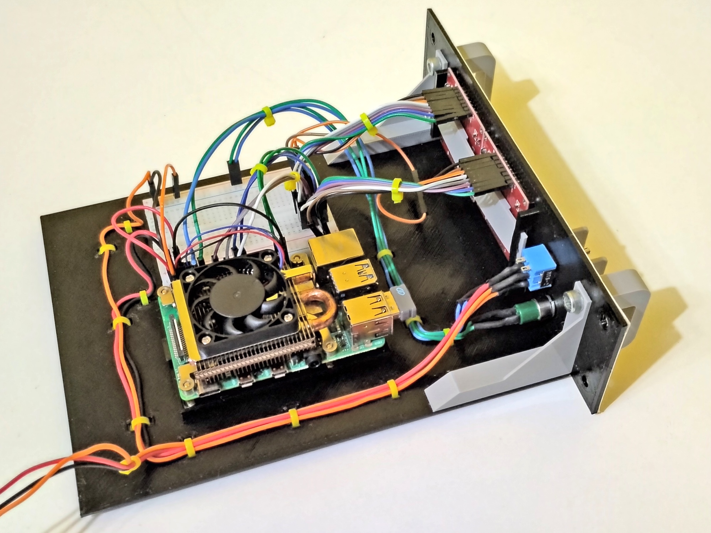
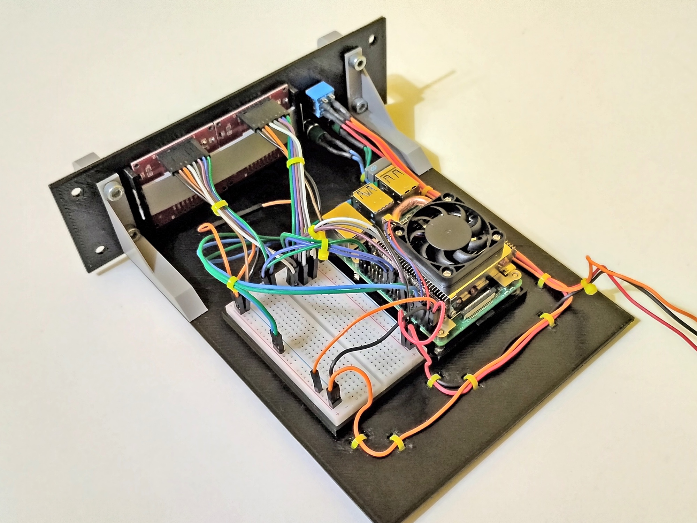
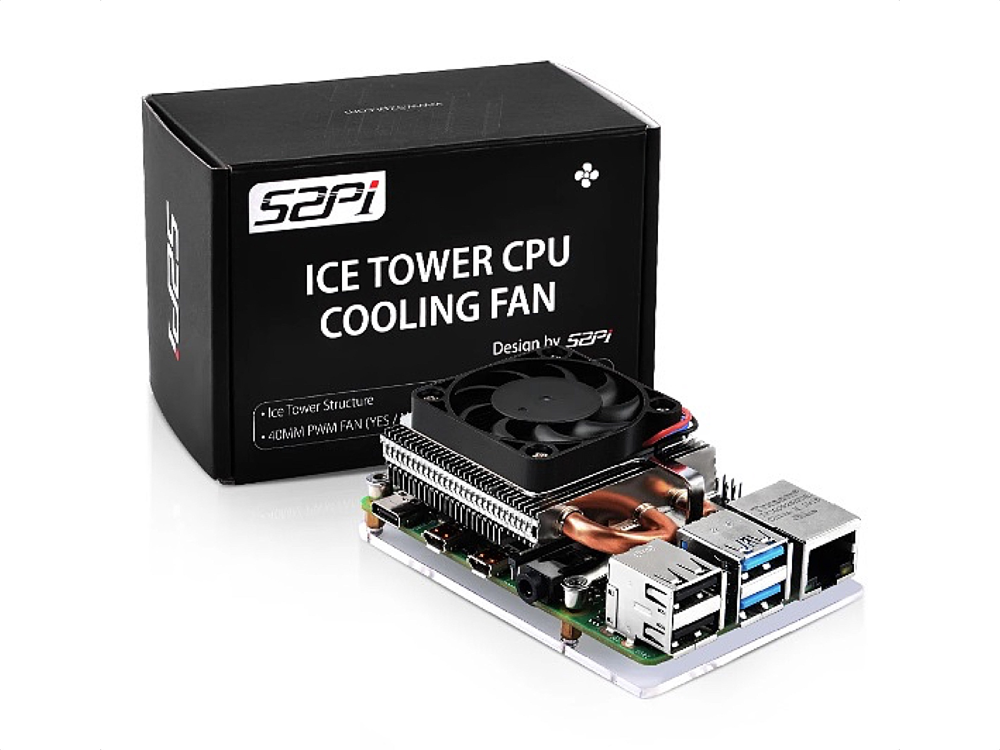
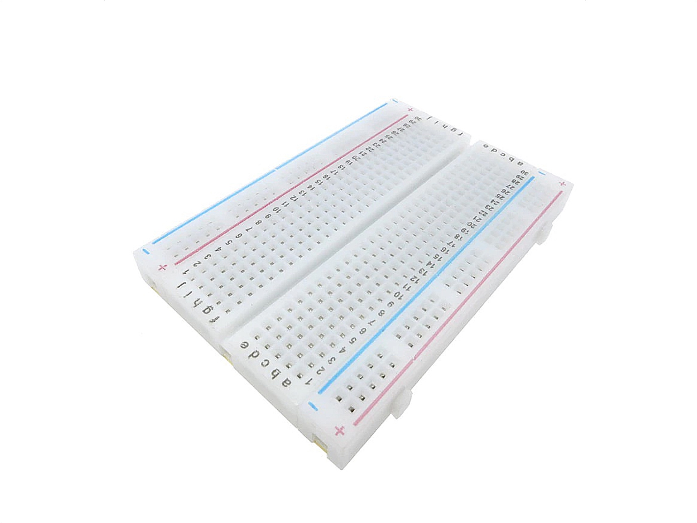
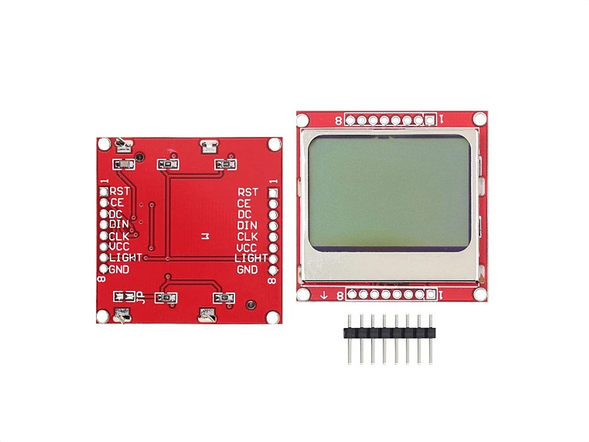
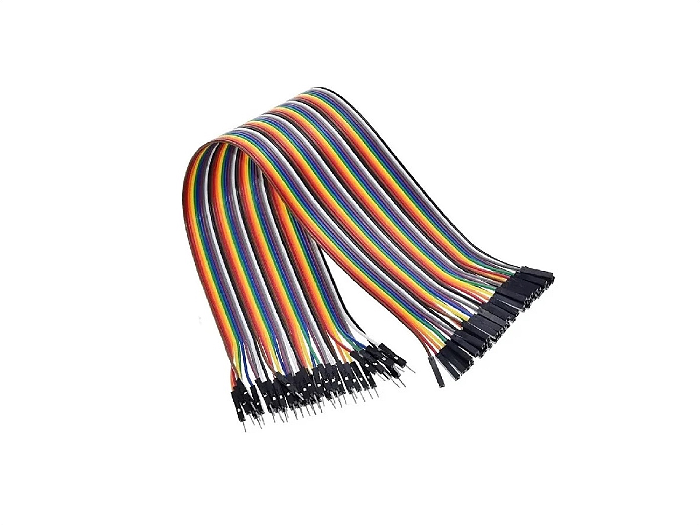

# Raspberry Pi CPU Module

## Description

...

## Schematics

## 3D Printed Parts

To make the 3d printed parts, I used an Creality Ender 3 similar 3d printer. Some parts I printed with 0.8mm nozzle, just for speed gain. For all the other parts, I used 0.4mm nozzle. The original editable .blend files are also included in the "3dprint" directory.

Caption|File|Prints|Nozzle|Supports|Description|
|---|---|---|---|---|---|
| 1|[rpicpu.base.stl](./3dprint/rpicpu/rpicpu.base.stl)|1|0.8|No|Module base.|
| 2|[rpicpu.innersupport.left.stl](./3dprint/rpicpu/rpicpu.innersupport.left.stl)|1|0.4|Maybe|Left inner support for the usb hub circuit.|
| 3|[rpicpu.innersupport.right.stl](./3dprint/rpicpu/rpicpu.innersupport.right.stl)|1|0.4|Maybe|Right inner support for the usb hub circuit.|
| 4|[rpicpu.panel.lcdsupport.stl](./3dprint/rpicpu/rpicpu.panel.lcdsupport.stl) |1|0.4|Yes|Inner support for LCD modules.|
| 5|[rpicpu.panel.front.stl](./3dprint/rpicpu/rpicpu.panel.front.stl) |1|0.8|Yes|Front panel for the module.|
| 6|[rpicpu.panel.powerpanel.stl](./3dprint/rpicpu/rpicpu.panel.powerpanel.stl)|1|0.4|No|Module switch protector.|
| 7|[rpicpu.panel.handler.stl](./3dprint/rpicpu/rpicpu.panel.handler.stl)|2|0.4|Maybe|Module handlers.|

## Paper Printed Parts

I used inkjet printer and an off-white 180g/m2 paper to make the front panel of the modules. In Brazil, this paper is known as "Color Plus 180g Marfim". To create these files, I used a software called "Graphics", that works on Mac.

|File|Graphics File|Description|
|---|---|---|
|[print.rpicpu.panel.pdf](./print/print.rpicpu.panel.pdf)|[print.rpicpu.panel.zip](./print/print.rpicpu.panel.zip)|Raspberry Pi CPU Module front panel.|

## Shopping List

Qty|Description|
|---|---|
|  1| USB Hub. I found mine in [this link](https://pt.aliexpress.com/item/1005001774949015.html). |
| some|Nylon cable ties.|
|  4|Allen Bolt M5x6 Cylindrical Head.|
|  8|Allen Bolt M5x6 Flat Head.|
|  4|Hammer Nut M5.|
| ~ 125g | PLA 3D print filament.|

## Nuts and Bolts

Picture|Description|
|---|---|
||Allen Bolt M5x6 Cylindrical Head (5mm on diameter, 6mm on length)|
||Allen Bolt M5x6 Flat Head (5mm on diameter, 6mm on length)|
||Hammer Nut M5 (for 5mm diameter bolts)|

## Pictures

