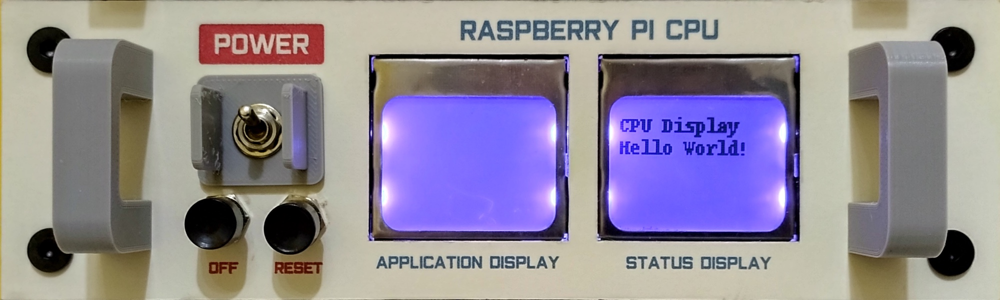
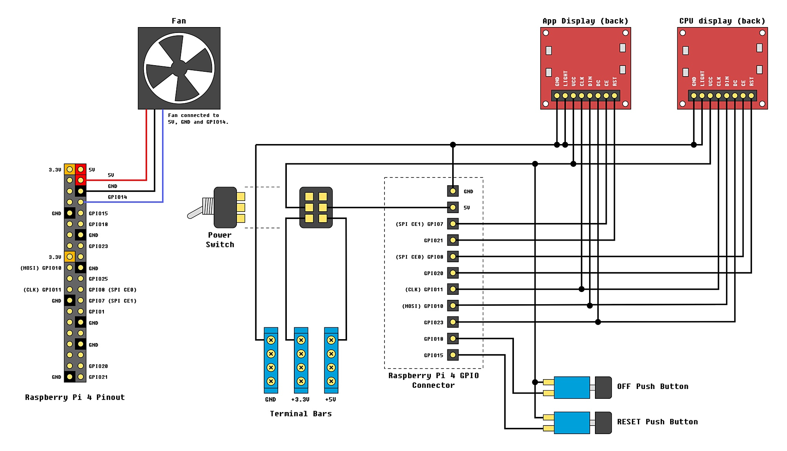
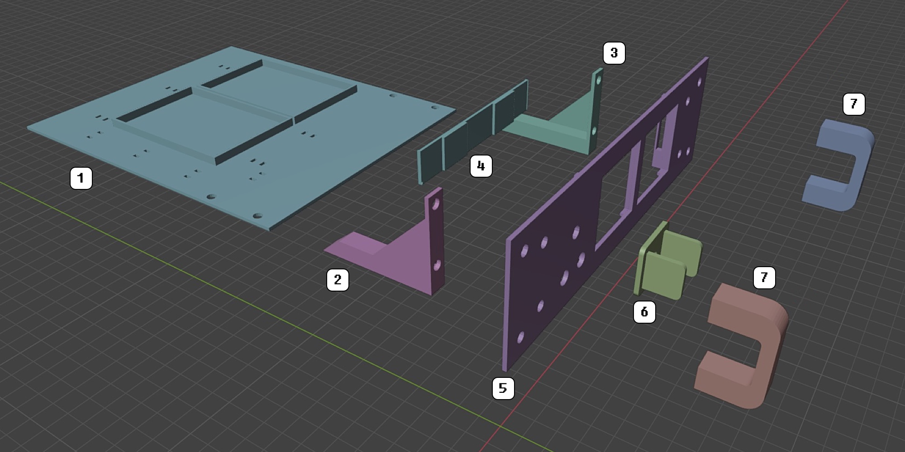
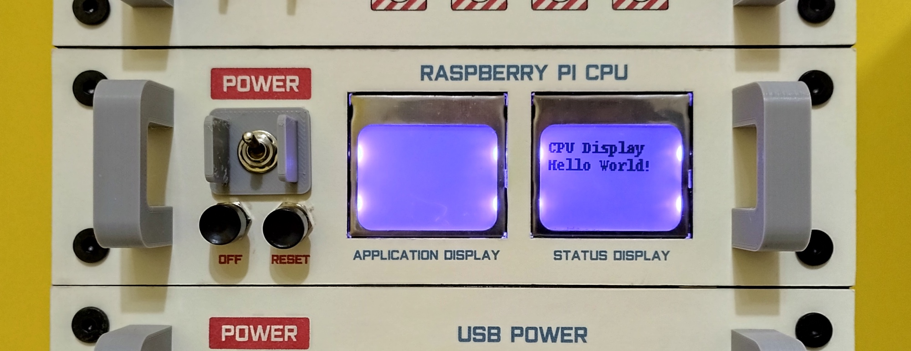
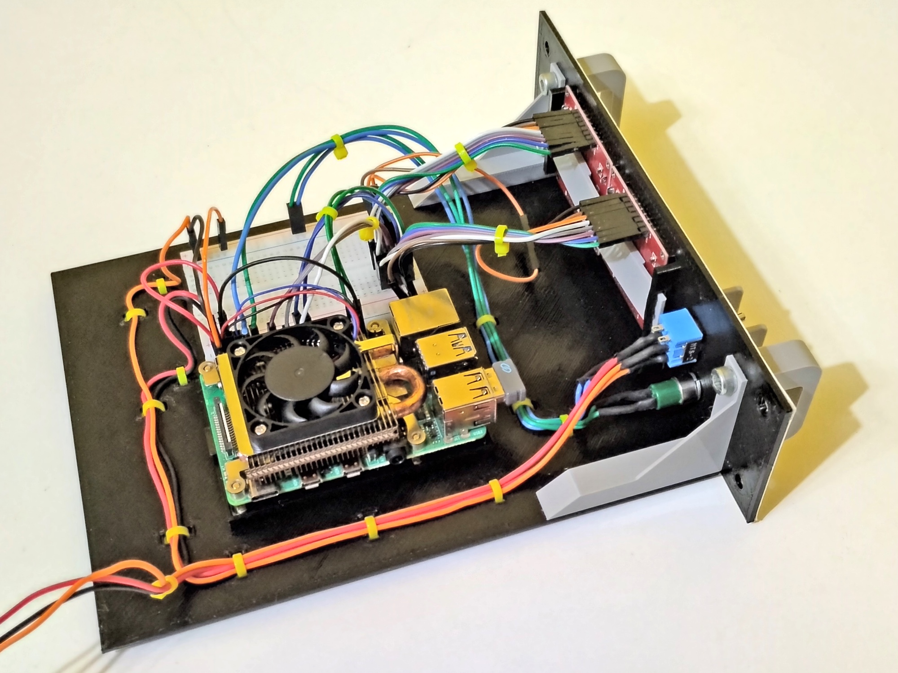
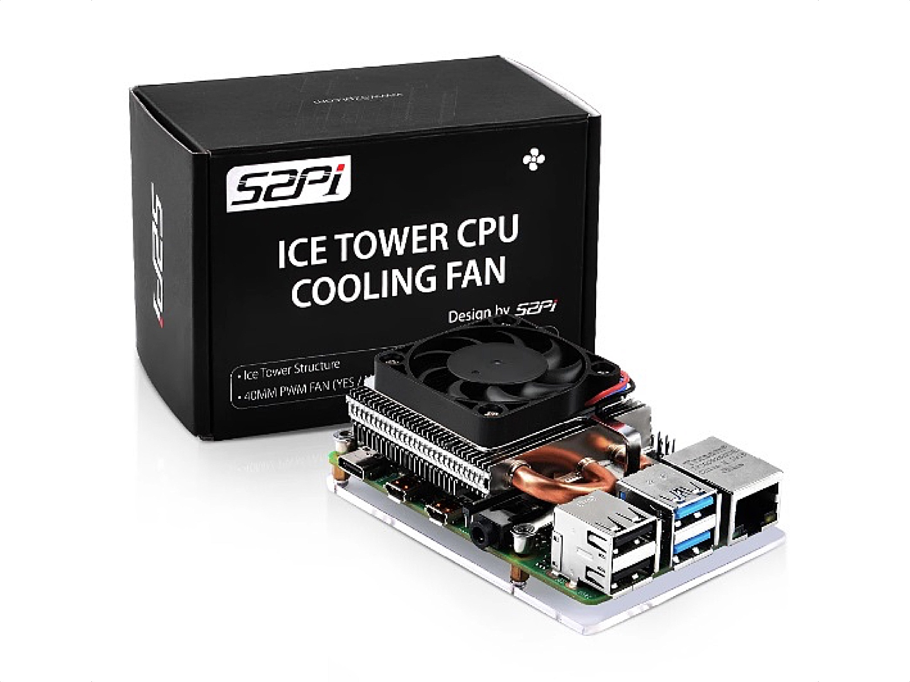
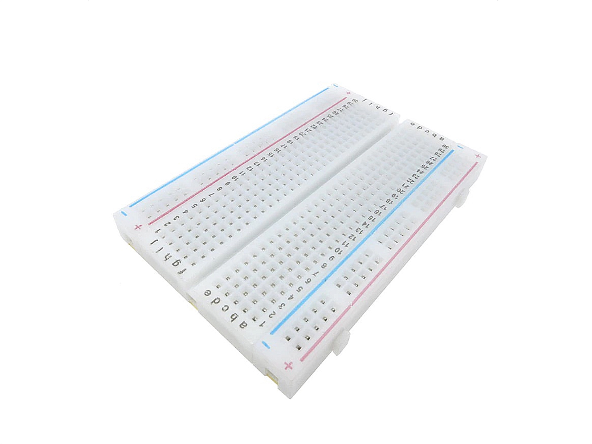
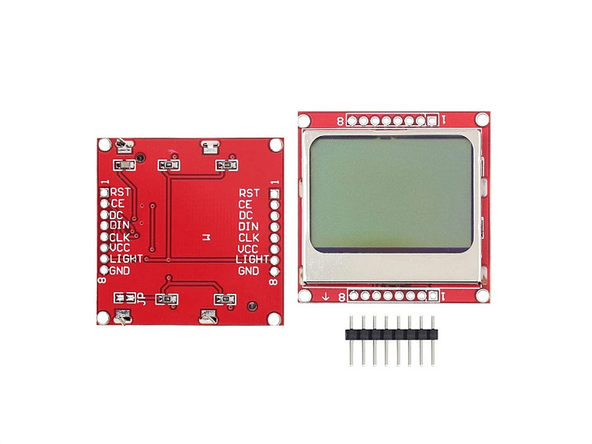
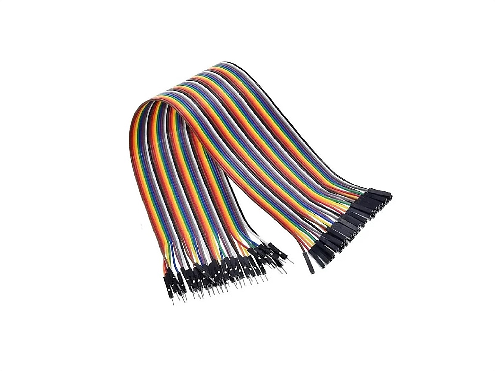

# Raspberry Pi CPU Module

## Description



This module is "a brain" for the minilab. I connected 2 Nokia 5110 displays to the Raspberry Pi SPI interface. One for system status and another one for application informations. I also decided to use a Ultra Thin Ice Tower Cooler, because in addition to the 2 power wires, it also has a third wire through which the fan speed can be measured. I also decided to use a 400 points breadboard, for a small hacking space.

## Schematics



## 3D Printed Parts

To make the 3d printed parts, I used an Creality Ender 3 similar 3d printer. Some parts I printed with 0.8mm nozzle, just for speed gain. For all the other parts, I used 0.4mm nozzle. The original editable .blend files are also included in the "3dprint" directory.

Caption|File|Prints|Nozzle|Supports|Description|
|---|---|---|---|---|---|
| 1|[rpicpu.base.stl](./3dprint/rpicpu/rpicpu.base.stl)|1|0.8|No|Module base.|
| 2|[rpicpu.innersupport.left.stl](./3dprint/rpicpu/rpicpu.innersupport.left.stl)|1|0.4|Maybe|Left inner support.|
| 3|[rpicpu.innersupport.right.stl](./3dprint/rpicpu/rpicpu.innersupport.right.stl)|1|0.4|Maybe|Right inner support.|
| 4|[rpicpu.panel.lcdsupport.stl](./3dprint/rpicpu/rpicpu.panel.lcdsupport.stl) |1|0.4|Yes|Inner support for LCD modules.|
| 5|[rpicpu.panel.front.stl](./3dprint/rpicpu/rpicpu.panel.front.stl) |1|0.8|Yes|Front panel for the module.|
| 6|[rpicpu.panel.powerpanel.stl](./3dprint/rpicpu/rpicpu.panel.powerpanel.stl)|1|0.4|No|Module switch protector.|
| 7|[rpicpu.panel.handler.stl](./3dprint/rpicpu/rpicpu.panel.handler.stl)|2|0.4|Maybe|Module handlers.|



## Paper Printed Parts

I used inkjet printer and an off-white 180g/m2 paper to make the front panel of the modules. In Brazil, this paper is known as "Color Plus 180g Marfim". To create these files, I used a software called "Graphics", that works on Mac. The original editable Graphics file for each print is in the print directory.

|File|Description|
|---|---|
|[print.rpicpu.panel.pdf](./print/print.rpicpu.panel.pdf)|Raspberry Pi CPU Module front panel.|

## Software


```bash
pip install RPi.GPIO
pip install Adafruit_GPIO
pip install pillow

sudo apt-get install git
git clone https://github.com/adafruit/Adafruit_Nokia_LCD.git
cd Adafruit_Nokia_LCD
sudo python setup.py install
cd ..

python src/monitor.py

```


## Shopping List

Qty|Description|
|---|---|
| 1 | Raspberry Pi board.|
| 1 | Ice Cube Cooler for Raspberry Pi (see Pictures). I found mine in [this link](https://pt.aliexpress.com/item/1005004647625855.html).|
| 2 | Nokia 5110 LCD displays (see Pictures).|
| 1 | 400 points breadboard (see Pictures).|
| 1 | Kit with 40 female-male jumpers 10cm min. length (see pictures).|
| 1 |Margirius lever microswitch bipolar with 2 positions (on/off).|
| 1 meter|0.30mm black wire.|
| 1 meter|0.30mm red wire.|
| 1 meter|0.30mm orange wire.|
| 1 meter|0.30mm red wire.|
| 1 meter|0.30mm any color wire, to connect the OFF push botton to the breadboard.|
| 1 meter|0.30mm any color wire, to connect the RESET push botton to the breadboard.|
| 15 ~ 20|Nylon cable ties.|
| 4 |Allen Bolt M5x6 Cylindrical Head.|
| 8 |Allen Bolt M5x6 Flat Head.|
| 4 |Hammer Nut M5.|
| 1 |Thick paper sheet (if you want to print the panel).|
| ~ 125g | PLA 3D print filament.|


## Nuts and Bolts

Picture|Description|
|---|---|
||Allen Bolt M5x6 Cylindrical Head (5mm on diameter, 6mm on length)|
||Allen Bolt M5x6 Flat Head (5mm on diameter, 6mm on length)|
||Hammer Nut M5 (for 5mm diameter bolts)|

## Pictures














