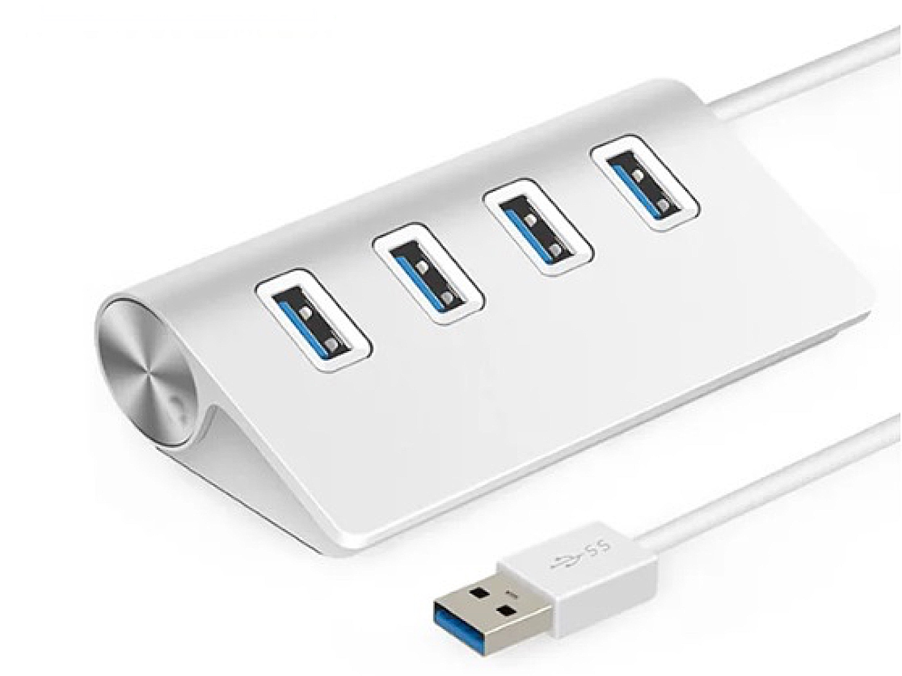

# USB Hub Module

## Description

This module is intended to provide USB connectivity from the CPU to other devices. These devices may be inside the minilab or outside (on a workbench, for example). I did´t built it from stratch. Instead, I used an USB hub with 4 ports. I chose this model because it has the USB ports well away from each other, and this is an important detail for a project I want to do in a near future.

## Schematics

## 3D Printed Parts

To make the 3d printed parts, I used an Creality Ender 3 similar 3d printer. Some parts I printed with 0.8mm nozzle, just for speed gain. For all the other parts, I used 0.4mm nozzle. The original editable .blend files are also included in the "3dprint" directory.

Caption|File|Prints|Nozzle|Supports|Description|
|---|---|---|---|---|---|
| 1|[usbhub.base.stl](./3dprint/usbhub/usbhub.base.stl)|1|0.8|No|Module base.|
| 2|[usbhub.innersupport.left.stl](./3dprint/usbhub/usbhub.innersupport.left.stl)|1|0.4|Maybe|Left inner support for the usb hub circuit.|
| 3|[usbhub.innersupport.right.stl](./3dprint/usbhub/usbhub.innersupport.right.stl)|1|0.4|Maybe|Right inner support for the usb hub circuit.|
| 4|[usbhub.innersupport.middle.stl](./3dprint/usbhub/usbhub.innersupport.middle.stl) |1|0.4|No|Main inner support for the usb hub circuit.|
| 5|[usbhub.panel.front.stl](./3dprint/usbhub/usbhub.panel.front.stl) |1|0.8|No|Front panel for the module.|
| 6|[usbhub.panel.powerpanel.stl](./3dprint/usbhub/usbhub.panel.powerpanel.stl)|1|0.4|No|Module switch protector.|
| 7|[usbhub.panel.handler.stl](./3dprint/usbhub/usbhub.panel.handler.stl)|2|0.4|Maybe|Module handlers.|

## Paper Printed Parts

I used inkjet printer and an off-white 180g/m2 paper to make the front panel of the modules. In Brazil, this paper is known as "Color Plus 180g Marfim". To create these files, I used a software called "Graphics", that works on Mac. The original editable Graphics file for each print is in the print directory.

|File|Graphics File|Description|
|---|---|---|
|[print.usbhub.panel.pdf](./print/print.usbhub.panel.pdf)|USB Hub Module front panel.|

## Shopping List

Qty|Description|
|---|---|
| 1 | USB Hub. I found mine in [this link](https://pt.aliexpress.com/item/1005001774949015.html). |
| 1 |Margirius lever microswitch bipolar with 2 positions (on/off).|
| 5 ~ 8|Nylon cable ties.|
| 4 |Allen Bolt M5x6 Cylindrical Head.|
| 8 |Allen Bolt M5x6 Flat Head.|
| 4 |Hammer Nut M5.|
| 1 |Thick paper sheet (if you want to print the panel).|
| ~ 125g | PLA 3D print filament.|

## Nuts and Bolts

Picture|Description|
|---|---|
||Allen Bolt M5x6 Cylindrical Head (5mm on diameter, 6mm on length)|
||Allen Bolt M5x6 Flat Head (5mm on diameter, 6mm on length)|
||Hammer Nut M5 (for 5mm diameter bolts)|

## Pictures

