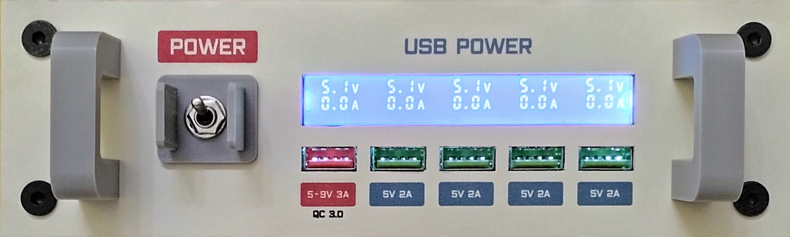
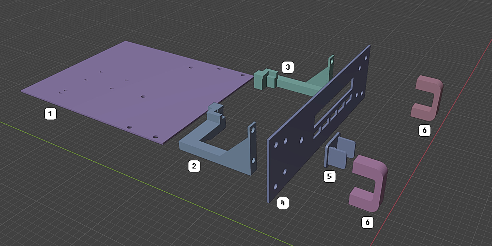
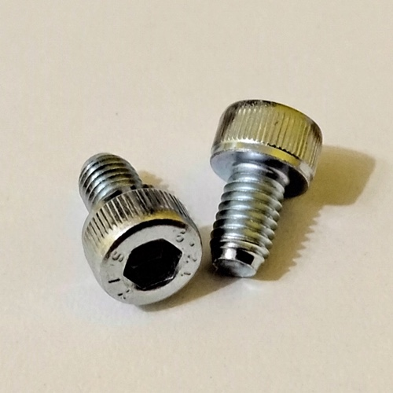
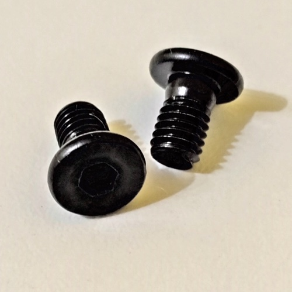
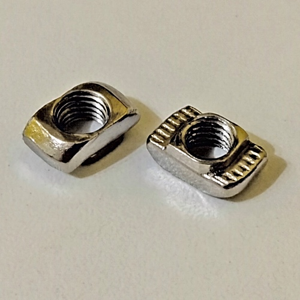
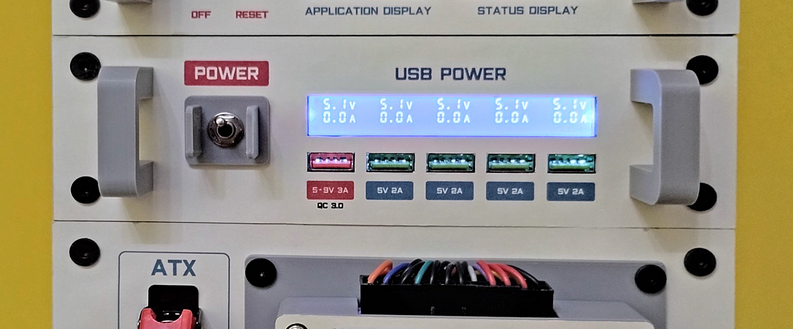
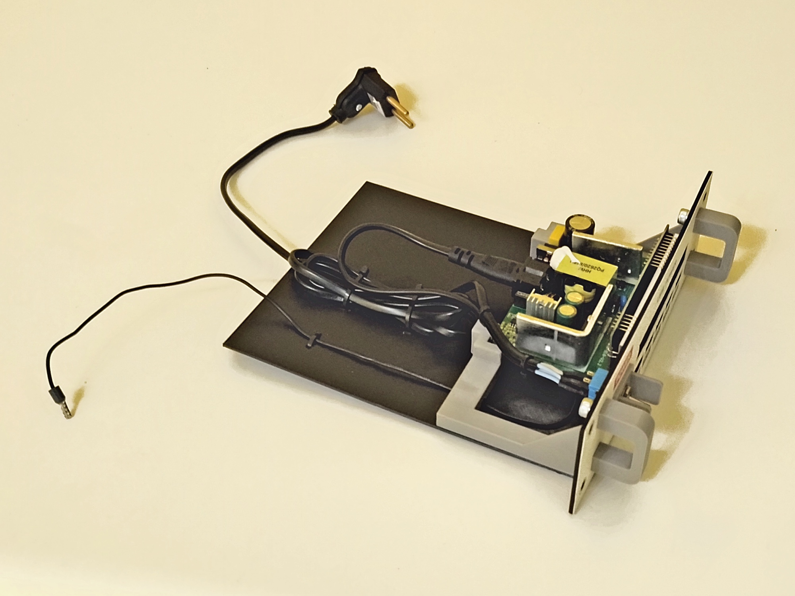
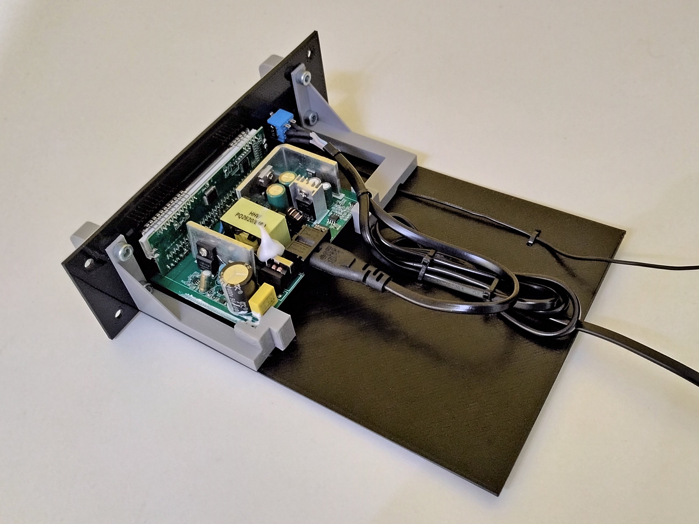
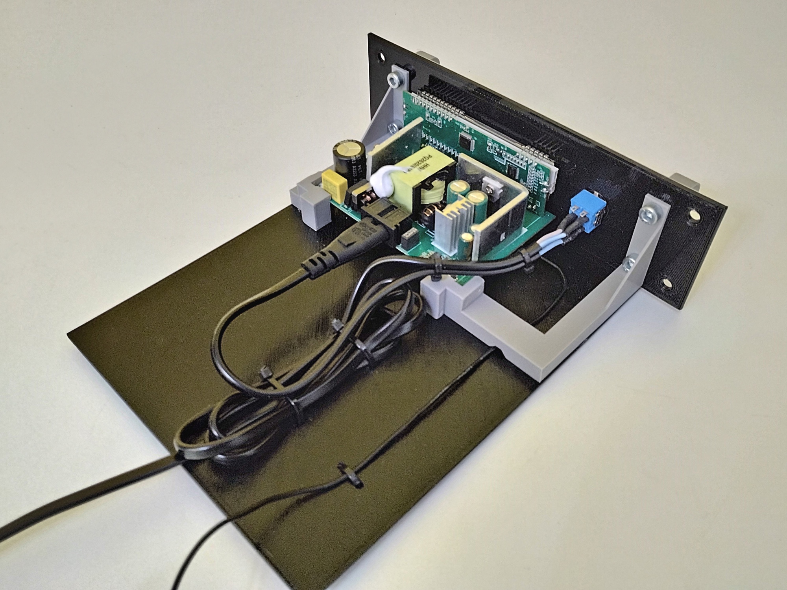

# USB Power Module

## Description

xxx

## Schematics

xxx

## 3D Printed Parts

To make the 3d printed parts, I used an Creality Ender 3 similar 3d printer. Some parts I printed with 0.8mm nozzle, just for speed gain. For all the other parts, I used 0.4mm nozzle. The original editable .blend files are also included in the "3dprint" directory.

Caption|File|Prints|Nozzle|Supports|Description|
|---|---|---|---|---|---|
| 1|[usbpower.base.stl](./3dprint/usbpower/usbpower.base.stl)|1|0.8|No|Module base.|
| 2|[usbpower.innersupport.left.stl](./3dprint/usbpower/usbpower.innersupport.left.stl)|1|0.4|Yes|Left inner support for the usb charger circuit.|
| 3|[usbpower.innersupport.right.stl](./3dprint/usbpower/usbpower.innersupport.right.stl)|1|0.4|Yes|Right inner support for the usb charger circuit.|
| 4|[usbpower.panel.front.stl](./3dprint/usbpower/usbpower.panel.front.stl) |1|0.8|No|Front panel for the module.|
| 5|[usbpower.panel.powerpanel.stl](./3dprint/usbpower/usbpower.panel.powerpanel.stl)|1|0.4|No|Power switch protector.|
| 6|[usbpower.panel.handler.stl](./3dprint/usbpower/usbpower.panel.handler.stl)|2|0.4|Maybe|Module handlers.|

## Paper Printed Parts

I used inkjet printer and an off-white 180g/m2 paper to make the front panel of the modules. In Brazil, this paper is known as "Color Plus 180g Marfim". To create these files, I used a software called "Graphics", that works on Mac.

xxx

## Shopping List

Qty|Description|
|---|---|
| 10|Allen Bolt M5x6 Cylindrical Head.|
|  4|Allen Bolt M5x6 Flat Head.|
|  4|Hammer Nut M5.|
| about 130g | PLA 3D print filament.|

## Nuts and Bolts

Picture|Description|
|---|---|
||Allen Bolt M5x6 Cylindrical Head (5mm on diameter, 6mm on length)|
||Allen Bolt M5x6 Flat Head (5mm on diameter, 6mm on length)|
||Hammer Nut M5 (for 5mm diameter bolts)|

## Pictures

