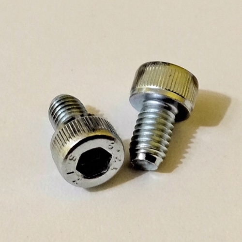

# Rear

## Description

This is the rear part of the minilab rack, where are all the module´s back cover and where the power strip are fixed on. 

## 3D Printed Parts

To make the 3d printed parts, I used an Creality Ender 3 similar 3d printer. Some parts I printed with 0.8mm nozzle, just for speed gain (where aesthetics were not so important). For all the other parts, I used 0.4mm nozzle. The original editable Blender files are also included in the "3dprint" directory.

Caption|File|Prints|Nozzle|Supports|Description|
|---|---|---|---|---|---|
| 1|[rear.baycover60mm.stl](./3dprint/rear/rear.baycover60mm.stl)|6|0.8|No|Bay cover for 60mm modules.|
| 2|[rear.baycover.psu.stl](./3dprint/rear/rear.baycover.psu.stl)|1|0.8|No|Bay cover for PSU module.|
| 3|[rear.cableguide.model4.stl](./3dprint/rear/rear.cableguide.model4.stl)|6|0.4|Maybe|Cable guide for 60mm modules.|
| 4|[psu.cableguide.model1.stl](./3dprint/rear/rear.cableguide.model1.stl) |1|0.4|No|Cable guide for PSU and power strip power cables.|
| 5|[psu.cableguide.model2.stl](./3dprint/rear/rear.cableguide.model2.stl) |1|0.4|Maybe|Cable guide for 12V terminal bar.|
| 6|[psu.cableguide.model3.stl](./3dprint/rear/rear.cableguide.model3.stl) |2|0.4|Maybe|Cable guide for 5V and 3.3V terminal bars.|
| 7|[psu.cableguide.model4.stl](./3dprint/rear/rear.cableguide.model4.stl) |1|0.4|Maybe|Cable guide for GND terminal bar.|
| 8|[psu.bottomcover.stl](./3dprint/rear/rear.bottomcover.stl)|1|0.8|No|Rear bottom cover.|

## Shopping List

Qty|Description|
|---|---|
| 1|Power strip with at least 4 power plugs.|
| 1 ~ 3|Nylon cable ties.|
| 52|Allen Bolt M5x6 Cylindrical Head.|
| 36|Spring Washer 5mm.|
| 36|Hammer Nut M5.|
|  2|Allen Bolt M3x20 with washer and pressure bolt, to fix the power strip to the bay covers.|
| ~ 310g | PLA 3D print filament. |

## Nuts and Bolts

Picture|Description|
|---|---|
||Allen Bolt M5x6 Cylindrical Head (5mm on diameter, 6mm on length)|
||Hammer Nut M5 (for 5mm diameter bolts)|
||Spring Washer 5mm|
||Allen Bolt M3x20 (3mm on diameter, 20mm on lenght) with washer and pressure bolt.|

## Pictures

