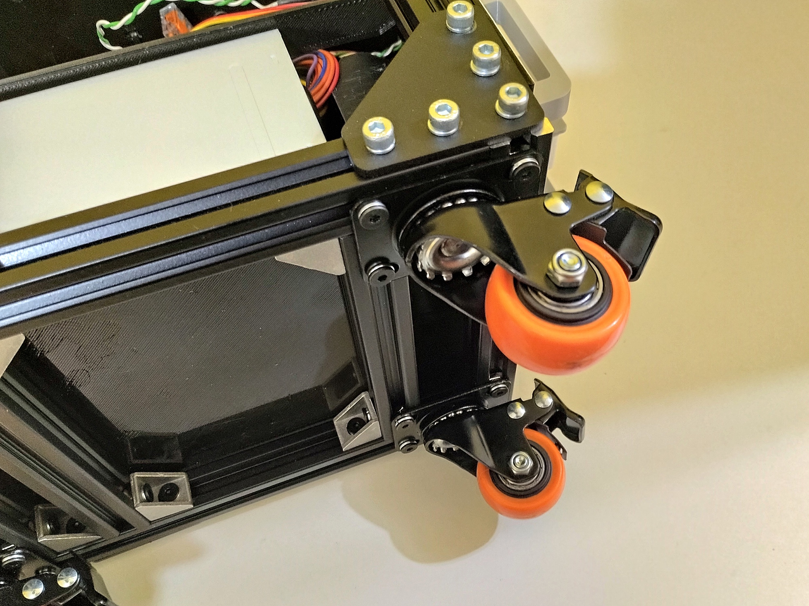

# Structure

## Description

This is all the metal parts and casters that forms the rack structure. 

## Schematics

Square size of the grid below = 1cm:

## Shopping List

Qty|Description|
|---|---|
| 6|540mm 20x20mm V-slot channel 6mm aluminum profile, for the vertical bars.|
| 4|240mm 20x20mm V-slot channel 6mm aluminum profile, for the side horizontal bars.|
| 4|200mm 20x20mm V-slot channel 6mm aluminum profile, for the front and back horizontal bars.|
|10|160mm 20x20mm V-slot channel 6mm aluminum profile, for the caster and bays supports.|
| 4|"T" connection plate for 20mm profile.|
|12|90 degrees connection plate for 20mm profile.|
|12|90 degrees connection plate for 20mm profile.|
|20|20x20x17mm corner for V-slot or T-slot.|
| 4|Casters 39mm diameter wheel.|
| 80|Allen Bolt M5x6 Cylindrical Head.|
| 56|Allen Bolt M5x6 Flat Head.|
|136|Spring Washer 5mm.|
|128|Hammer Nut M5.|

## Nuts and Bolts

Picture|Description|
|---|---|
||Allen Bolt M5x6 Cylindrical Head (5mm on diameter, 6mm on length)|
||Allen Bolt M5x6 Flat Head (5mm on diameter, 6mm on length)|
||Hammer Nut M5 (for 5mm diameter bolts)|
||Spring Washer 5mm|

## Pictures

